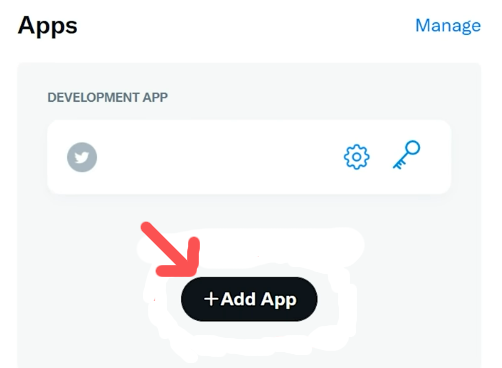
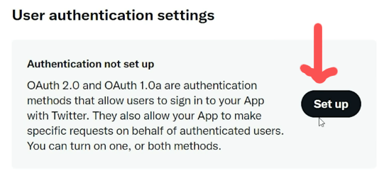
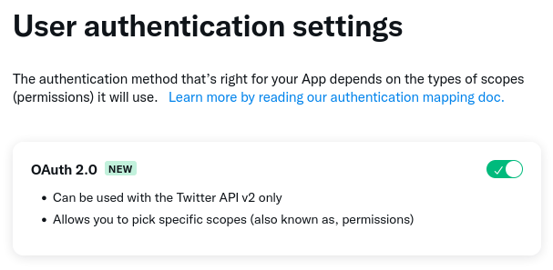

Providers and Publishers that are currently supported
----------------------------------------------------------------------

**Providers(The Platform From where the information is coming from)**

- Github

**Publishers(The Platform where the information will be posted)**

- Twitter
- Github

Before running the bot, you must configure it  so that it can connect to the current supported platforms

Environment variables need for Providers and Publishers
----------------------------------------------------------------------
Github 
----------------------------------------------------------------------
- GITHUB_ACCESS_TOKEN

_NOTE: If you want the content to be published in a README file on a repo, you also need these variables_
- GITHUB_PUBLISH_REPO_OWNER (Your Github username)
- GITHUB_PUBLISH_REPO_NAME (The name of the repo where your README is. It has to be public)
- GITHUB_PUBLISH_REPO_FILE (By default is README)

Twitter
----------------------------------------------------------------------
- TWITTER_CLIENT_ID
- TWITTER_CLIENT_SECRET

How to setup the environment variables for the platforms
----------------------------------------------------------------------

Github
----------------------------------------------------------------------

To generate the github access tokens follow the given steps

1. Verify your email address, if it hasn't been verified yet.

2. In the upper-right corner of your github profile, click your profile photo, then click Settings.

3. In the left sidebar, click Developer settings.

4. In the left sidebar, click Personal access tokens.

5. Click Generate new token.

6. Give your token a descriptive name.

7. To give your token an expiration, select the Expiration drop-down menu, then click a default or use the calendar picker.

8. Select the scopes, or permissions, you'd like to grant this token. To use your token to access repositories from the command line, select repo.

9. Click Generate token.

For further information click [here](https://docs.github.com/en/authentication/keeping-your-account-and-data-secure/creating-a-personal-access-token)

Twitter
----------------------------------------------------------------------

To generate the Twitter client id and secret, follow the given steps

1. Create an developer account, if you don't have any visit this [link](https://developer.twitter.com/en/portal/petition/essential/basic-info). Otherwise follow next step.

2. Visit the twitter [developer dashboard](https://developer.twitter.com/en/portal/dashboard).

3. Create or add an app. Give it a name and finally you will be prompted with access-tokens(not needed).

4. Now, click on app's setting and do the following steps:-

    1. Under authentication settings, click on setup option.
    

    2. Then enable OAuth2.0 option.
    

    3. Set **Type of App** --> "Automated App or bot".
    4. Set **Callback URI** --> "http://localhost:8080/callback".
    5. Set **Website URL** --> "https://ezeoleaf.github.io/larry/".
    

    6. Then click save.

5. Save the generated Client ID and Secret to somewhere.

For getting Twitter keys and secrets click [here](https://developer.twitter.com/en/docs/apps/overview) 
